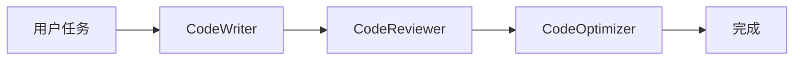
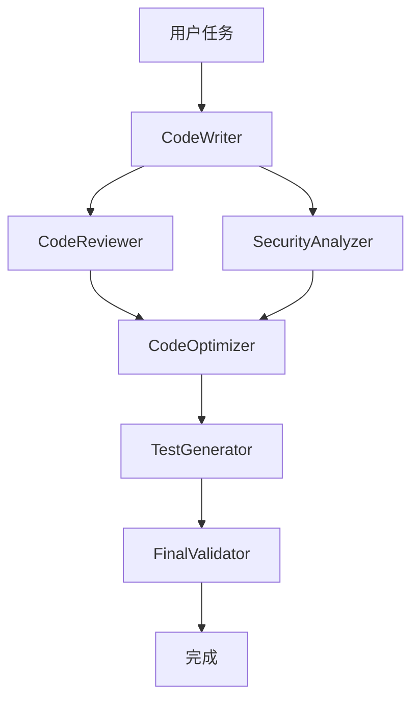

# AutoGen编程工作流系统

基于Microsoft AutoGen框架构建的智能编程工作流系统，实现多Agent协作完成代码编写、审阅、优化的完整流程。

## 🌟 特性

### 基础工作流 (`autogen_programming_workflow.py`)
- **Agent1 (CodeWriter)**: 专业代码编写专家
- **Agent2 (CodeReviewer)**: 资深代码审阅专家  
- **Agent3 (CodeOptimizer)**: 代码优化专家
- **RoundRobinGroupChat**: 顺序执行的团队协作模式

### 高级工作流 (`autogen_advanced_programming_workflow.py`)
- **多Agent并行处理**: 支持代码审阅和安全分析并行执行
- **GraphFlow工作流**: 复杂的有向图工作流程
- **消息过滤**: 智能消息过滤确保Agent接收相关信息
- **安全分析**: 专门的安全分析Agent
- **测试生成**: 自动生成测试代码
- **最终验证**: 完整的质量验证和总结

## 🚀 快速开始

### 1. 安装依赖

```bash
pip install autogen-agentchat autogen-ext[openai]
```

### 2. 设置环境变量

```bash
export OPENAI_API_KEY="your-openai-api-key"
```

### 3. 运行基础工作流

```python
python autogen_programming_workflow.py
```

### 4. 运行高级工作流

```python
python autogen_advanced_programming_workflow.py
```

## 📋 使用示例

### 基础工作流示例

```python
import asyncio
from autogen_programming_workflow import ProgrammingWorkflow, ProgrammingTask

async def main():
    workflow = ProgrammingWorkflow(model_name="gpt-4o")
    
    task = ProgrammingTask(
        description="创建一个Python类来管理图书馆系统",
        requirements=[
            "支持图书的增删改查操作",
            "实现图书借阅和归还功能", 
            "支持用户管理",
            "包含数据验证和异常处理"
        ],
        language="python"
    )
    
    await workflow.run_programming_task(task)
    await workflow.close()

asyncio.run(main())
```

### 高级工作流示例

```python
import asyncio
from autogen_advanced_programming_workflow import AdvancedProgrammingWorkflow, AdvancedProgrammingTask

async def main():
    workflow = AdvancedProgrammingWorkflow(model_name="gpt-4o")
    
    task = AdvancedProgrammingTask(
        description="开发一个电商支付系统",
        requirements=[
            "支持多种支付方式",
            "实现订单管理",
            "支持退款功能",
            "提供支付状态查询"
        ],
        language="python",
        complexity_level="high",
        security_requirements=[
            "支付数据加密",
            "防止重复支付",
            "实现支付验证机制"
        ],
        performance_requirements=[
            "支持高并发处理",
            "响应时间小于100ms"
        ]
    )
    
    await workflow.run_advanced_task(task)
    await workflow.close()

asyncio.run(main())
```

## 🏗️ 架构设计

### 基础工作流架构



### 高级工作流架构



## 🔧 配置选项

### 模型配置
- 支持OpenAI GPT-4o、GPT-4等模型
- 可自定义API密钥和模型参数

### 终止条件
- 文本关键词终止
- 最大消息数限制
- 组合条件支持

### Agent配置
- 自定义系统消息
- 专业角色定义
- 消息过滤配置

## 📊 工作流程详解

### 基础工作流程
1. **CodeWriter**: 根据需求编写初始代码
2. **CodeReviewer**: 审阅代码，提出改进建议
3. **CodeOptimizer**: 根据审阅意见优化代码

### 高级工作流程
1. **CodeWriter**: 编写初始代码
2. **并行处理**:
   - **CodeReviewer**: 代码质量审阅
   - **SecurityAnalyzer**: 安全性分析
3. **CodeOptimizer**: 综合优化代码
4. **TestGenerator**: 生成测试代码
5. **FinalValidator**: 最终验证和总结

## 🎯 最佳实践

### 任务定义
- 明确具体的功能需求
- 列出详细的技术要求
- 指定编程语言和复杂度

### Agent协作
- 利用专业化分工提高效率
- 使用消息过滤避免信息过载
- 设置合理的终止条件

### 质量保证
- 多轮审阅确保代码质量
- 安全分析防范潜在风险
- 自动化测试验证功能正确性

## 🔍 扩展功能

### 自定义Agent
```python
custom_agent = AssistantAgent(
    name="CustomAgent",
    model_client=model_client,
    system_message="你的自定义系统消息",
    description="Agent描述"
)
```

### 自定义工作流
```python
builder = DiGraphBuilder()
builder.add_node(agent1).add_node(agent2)
builder.add_edge(agent1, agent2)
graph = builder.build()
flow = GraphFlow(participants=[agent1, agent2], graph=graph)
```

## 📝 注意事项

1. **API配额**: 注意OpenAI API的使用配额和费用
2. **模型选择**: 根据任务复杂度选择合适的模型
3. **错误处理**: 实现适当的异常处理机制
4. **资源管理**: 及时关闭模型客户端连接

## 🤝 贡献

欢迎提交Issue和Pull Request来改进这个项目！

## 📄 许可证

MIT License
